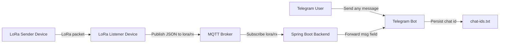

# 🚀 LoRa MQTT Telegram IoT App

<div align="center">
  <h3>Project Architecture</h3>



</div>

### Telegram Preview

- ✅ **LoRa -> MQTT -> Telegram message pipeline**
- ✅ **Spring Boot Telegram bot with auto chat ID registration**
- ✅ **Fast startup with Docker Compose (backend + Mosquitto)**

<br>

Used Technologies in The Project:

[](https://www.java.com/en/)
[](https://spring.io/)
[](https://gradle.org/)
[](https://github.com/rubenlagus/TelegramBots)
[](https://mosquitto.org/)
[](https://docs.docker.com/compose/)

---

## 📌 What Is This Project?

This repository is an end-to-end IoT messaging setup that carries messages from a LoRa sender device to Telegram users.

**What it does:**

- Sends text messages from the sender web panel over LoRa
- Receives LoRa packets on a listener device and publishes them to MQTT as JSON
- Subscribes to `lora/rx` in Spring Boot backend and extracts the `msg` field
- Broadcasts messages to all registered Telegram chat IDs
- Saves discovered chat IDs into `chat-ids.txt`

---

## 🧠 How It Works

**Flow:**

```text
1) Telegram user sends any message to the bot
2) Bot stores the user's chatId in chat-ids.txt
3) LoRa sender transmits a message packet
4) LoRa listener receives packet and publishes JSON to MQTT topic lora/rx
5) Backend consumes lora/rx, reads msg, and sends to all registered chatIds
```

---

## 🔁 Runtime Data Contract

Listener publishes payloads like this:

```json
{
  "msg": "Hello from LoRa",
  "rssi": -73.5,
  "snr": 9.2
}
```

Backend forwards only the `msg` value to Telegram.

---

## 🛠️ Project Structure

```text
.
├── docker-compose.yml
├── lora_sender/
│   └── lora_sender.ino
├── lora_listener/
│   └── lora_listener.ino
├── mqtt/
│   └── config/mosquitto.conf
└── lora-backend/
    ├── build.gradle
    ├── Dockerfile
    ├── chat-ids.txt
    └── src/main/java/com/furkankayam/
        ├── SpringBootTelegramApplication.java
        ├── bot/
        │   ├── BotInitializer.java
        │   └── TelegramBot.java
        ├── config/
        │   ├── MqttConfig.java
        │   └── TelegramConfig.java
        └── service/
            └── MqttCallbackService.java
```

---

## ⚙️ Configuration

`lora-backend/src/main/resources/application.yaml`:

```yaml
spring:
  application:
    name: lora-mqtt-telegram-iot-app-backend

bot:
  name: <YOUR_TELEGRAM_BOT_NAME>
  token: <YOUR_TELEGRAM_BOT_TOKEN>
  chat-ids-file: chat-ids.txt

mqtt:
  client-id: <YOUR_MQTT_CLIENT_ID>
  broker-url: ${BROKER_URL:tcp://localhost:1883}
  subscribe-topic: ${SUBSCRIBE_TOPIC:lora/rx}
```

### Important Notes

- Each line in `chat-ids.txt` must contain one valid numeric chat ID.
- Do not commit your real Telegram bot token.
- In Docker Compose, backend connects to broker via `tcp://mqtt:1883`.

---

## 🚀 Setup and Run

### 1) Prerequisites

- Java 17+
- Docker Desktop (recommended)
- Telegram bot token created via BotFather
- LoRa-capable sender and listener devices (or equivalent test setup)

### 2) Start Backend + MQTT with Docker

```powershell
docker compose up -d --build backend-service mqtt
```

### 3) Run Backend Locally (PowerShell)

```powershell
cd lora-backend
.\gradlew.bat bootRun
```

### 4) Device Side

- Flash `lora_sender/lora_sender.ino` to sender board
- Flash `lora_listener/lora_listener.ino` to listener board
- Configure listener WiFi/MQTT values from its web settings panel

---

## ✅ Test

```powershell
cd lora-backend
.\gradlew.bat test --no-daemon
```

---

## 📮 How to Use

1. Open your bot in Telegram.
2. Send any message to register your chat ID.
3. Open sender web panel and submit a message.
4. Listener publishes packet to MQTT.
5. Backend forwards the message to all registered Telegram chats.

---

## 🧯 Troubleshooting

### Backend cannot connect to MQTT

- Verify broker address and port.
- Check that Mosquitto is running and reachable.
- Confirm `BROKER_URL` value in environment.

### Messages are not delivered to Telegram

- Verify `bot.token` and bot username.
- Ensure user/group has sent at least one message to the bot.
- Confirm `chat-ids.txt` is writable.

### Listener receives LoRa but backend gets nothing

- Ensure listener publishes to `lora/rx`.
- Confirm payload includes `msg` field.
- Check backend logs for subscription and callback errors.

### LoRa communication issues

- Verify both boards use same frequency/sync settings.
- Validate pin mapping and antenna/hardware setup.

---

## 🔐 Security Recommendations

- Provide `bot.token` via environment variable or secret management.
- Rotate token immediately if exposed.
- Restrict access to `chat-ids.txt` in production deployments.

---

# License

This project is licensed under the MIT License. See the [LICENSE](LICENSE) file for details.

**Created by** [Mehmet Furkan KAYA](https://www.linkedin.com/in/mehmet-furkan-kaya/)
